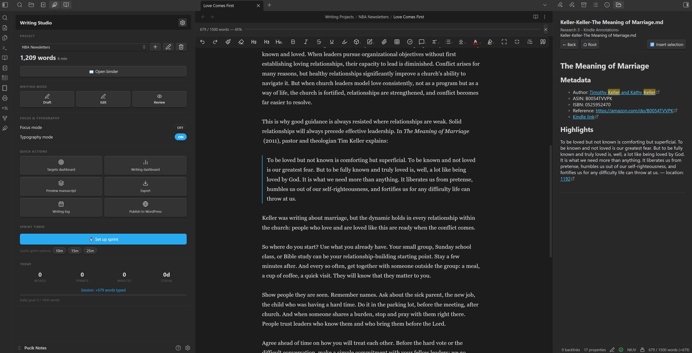
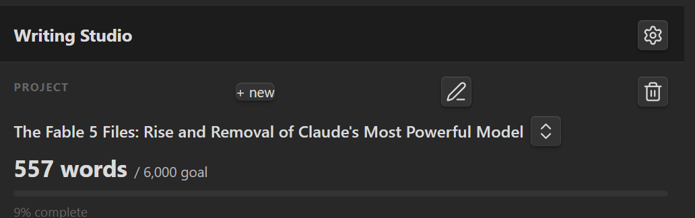
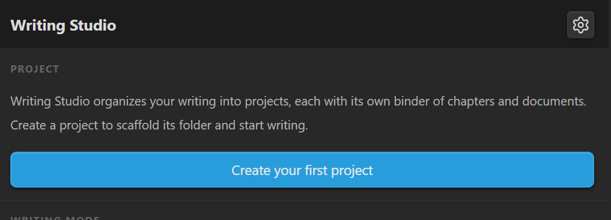
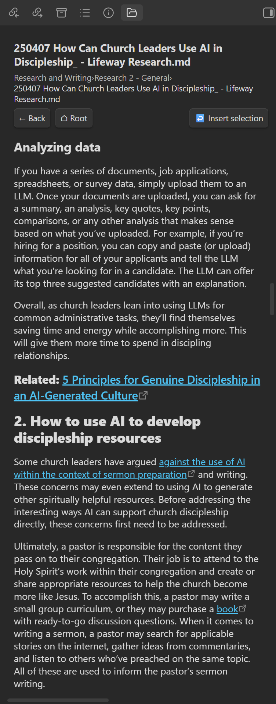
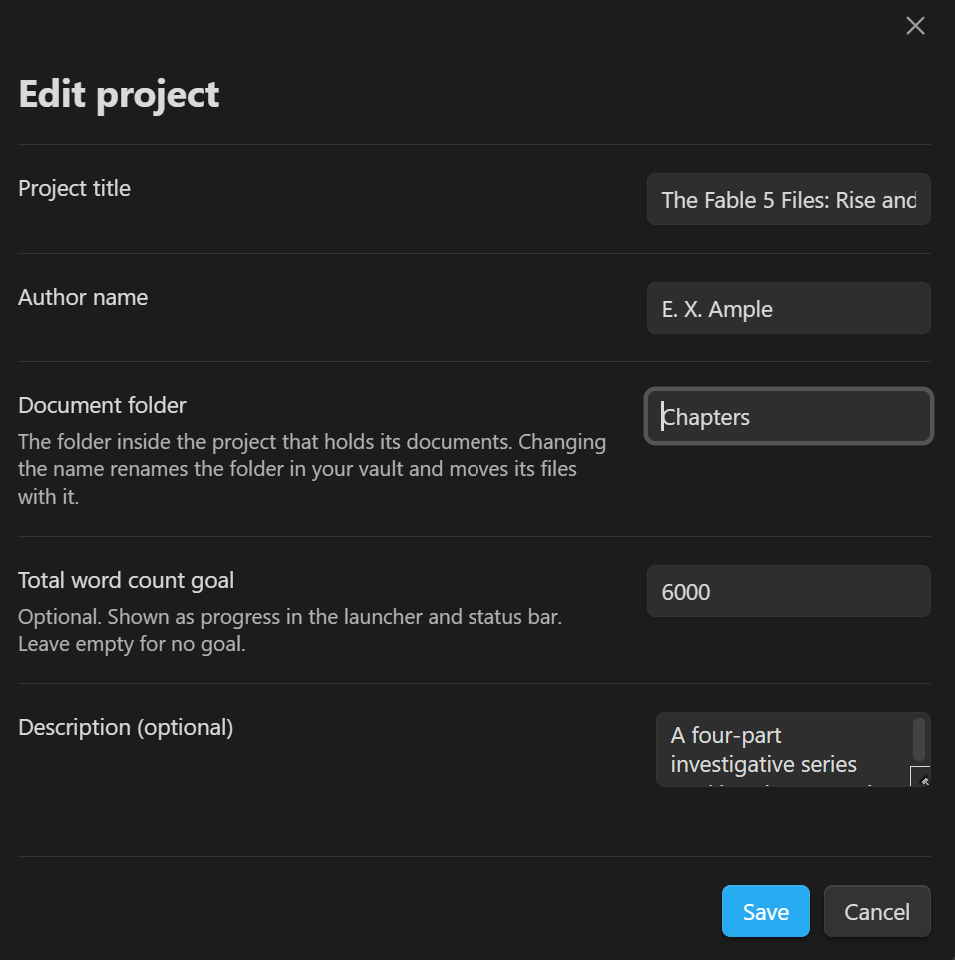
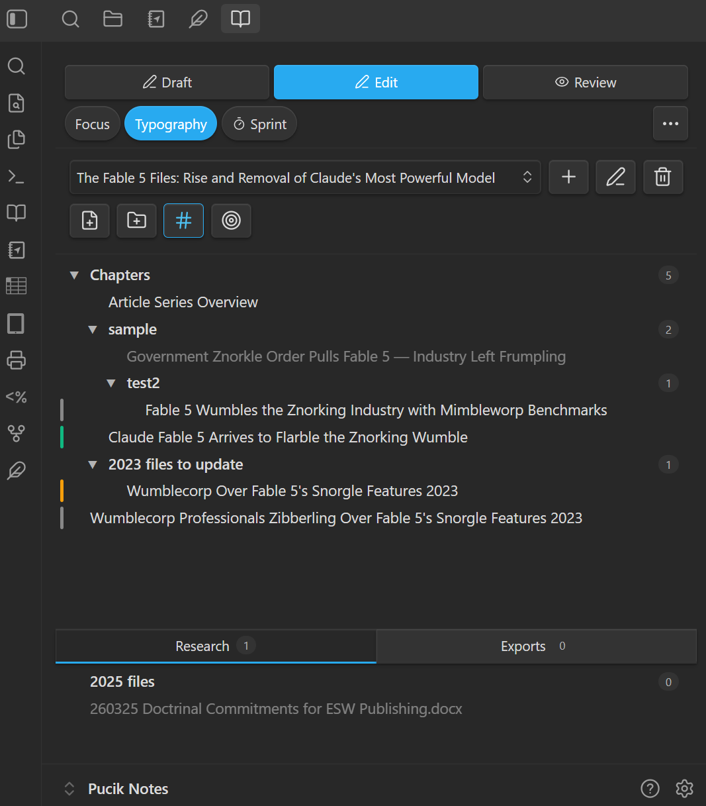
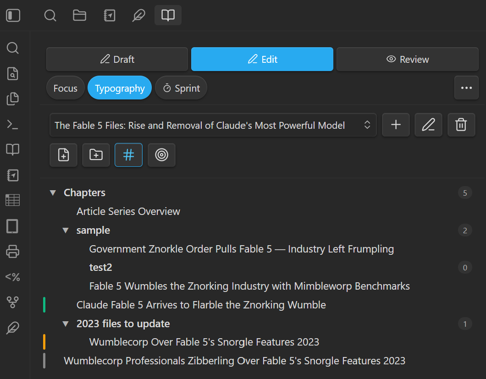
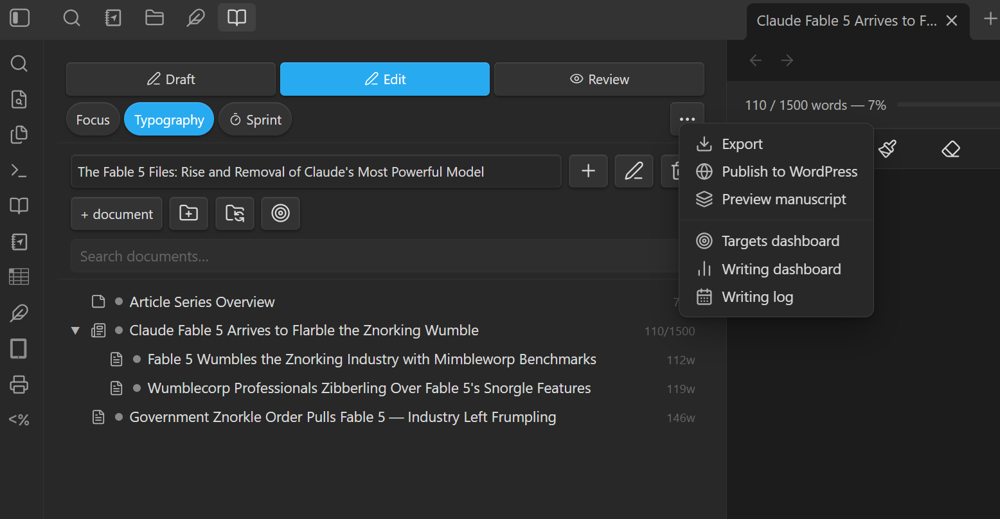
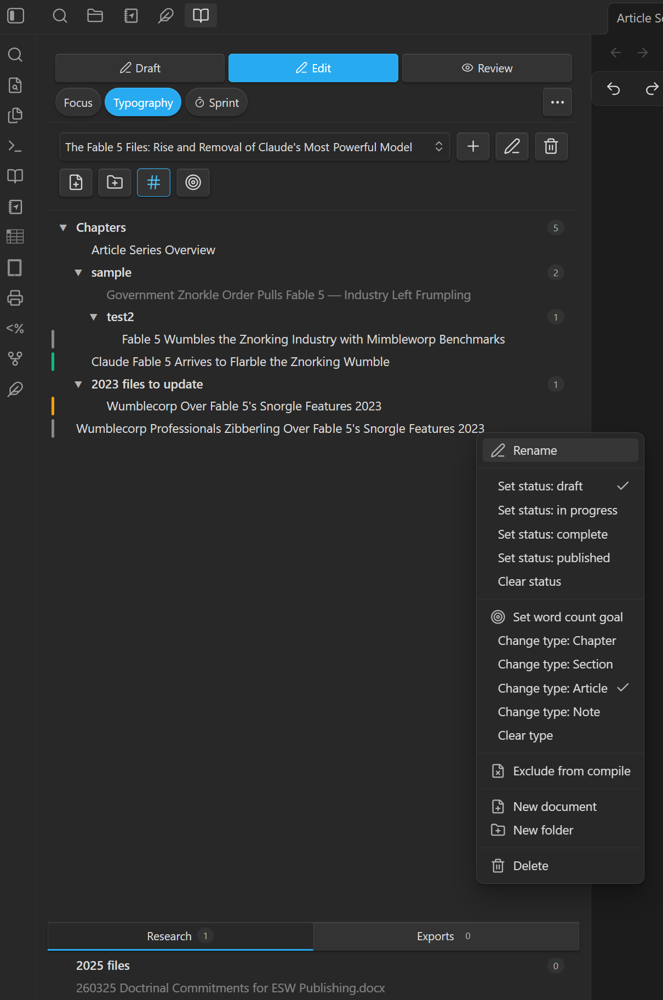
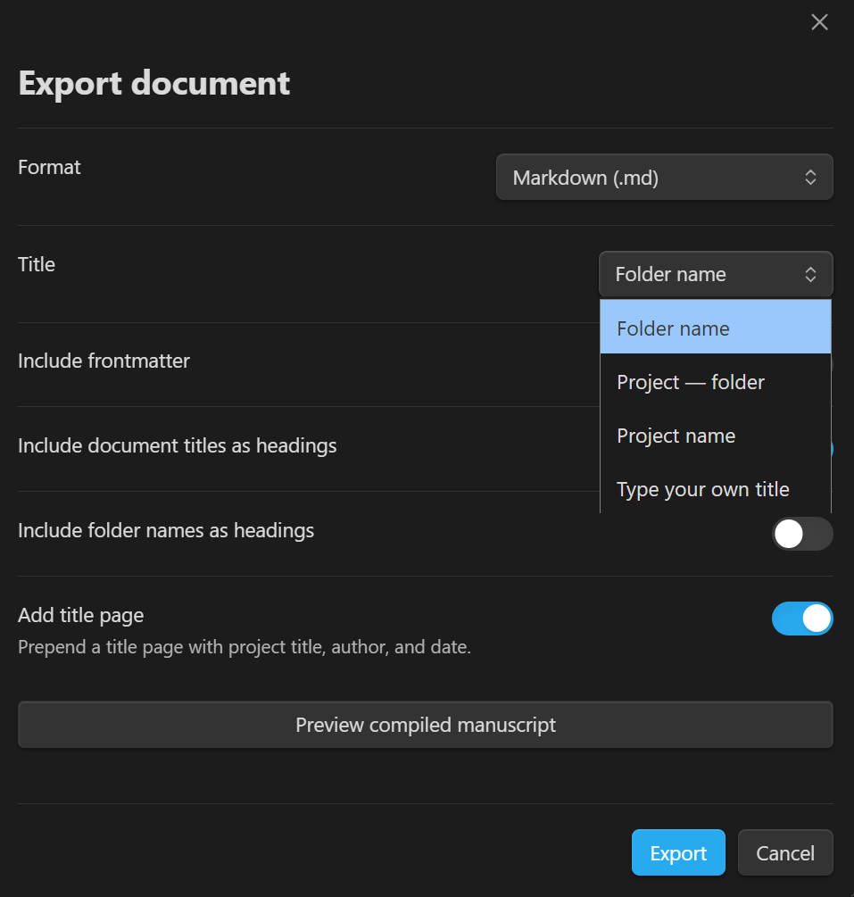

  

# Writing Studio

**Version 3.0.0** · Desktop only

Writing Studio turns Obsidian into a dedicated environment for serious nonfiction work — from your first research notes to a finished, exported manuscript. It bundles a project binder, writing modes, focus and typography tools, sprint timer, progress tracking, manuscript export, and WordPress publishing into a single plugin. A built-in sidebar file explorer lets you browse, preview, and pull content from anywhere in your vault without leaving your draft.

  
   
  <em>Writing Studio in use — Launcher (left), active draft with word count goal banner (center), Folder Sidebar Explorer open to a research folder (right).</em>

  

## Contents

- [Features](#features)
- [Language support](#language-support)
- [Writing Studio Launcher](#writing-studio-launcher)
- [Folder Sidebar Explorer](#folder-sidebar-explorer)
- [Your Project](#your-project)
- [Your Writing Environment](#your-writing-environment)
- [Tracking Your Progress](#tracking-your-progress)
- [Getting Your Work Out](#getting-your-work-out)
- [Supporting Tools](#supporting-tools)
- [Context Menus](#context-menus)
- [Commands Reference](#commands-reference)
- [Settings Overview](#settings-overview)
- [Ribbon Icon](#ribbon-icon)
- [Installation](#installation)
- [Requirements](#requirements)
- [Reporting a Bug](#reporting-a-bug)
- [Security](#security)

---

## Features

**Writing Binder** — Your project's folder tree, rendered as a manuscript. The binder reads your folders directly, so files created, renamed, or moved anywhere — even outside Obsidian — always appear correctly, with no import or scan step. Drag chapters into order, set per-document status and word count goals, and exclude documents from compile with a right-click.

**Project Manager** — Create projects from six templates (blank, book, article series, blog collection, journal article, magazine article), set a total word count goal, and switch between projects from the Launcher.

**Compile Preview** — Concatenate all binder documents in order and render them as a finished manuscript in a split pane, without exporting.

**Writing Modes** — Switch between Draft (distraction-free), Edit (full tooling), and Review (read-only) modes from the status bar, command palette, context menu, or Launcher.

**Focus Mode** — Dim everything except the paragraph or sentence you are writing. Configurable dim level, font size override, sidebar collapse, and typewriter scroll.

**Typography Mode** — Apply a curated font, constrained line length, and controlled line height to the editor. Fourteen font options including iA Writer fonts, Google Fonts, and custom system fonts.

**Sprint Timer** — Run timed writing sessions with a draggable floating overlay. Set duration, word goal, and scope (file or project). Quick-start presets (10 m, 15 m, 25 m) available from the Launcher.

**Progress Tracking** — Live word counts in the status bar and Launcher, session delta tracking, per-document and per-project word count goals with inline progress banners, and a 30-day writing log with streak tracking.

**Export Engine** — Export to Manuscript (HTML), PDF, Word (.docx), RTF, HTML, Markdown, and EPUB. Manuscript format produces industry-standard layout with no external tools; other formats require Pandoc.

**WordPress Publishing** — Publish directly to WordPress from Obsidian. Set post title, status, categories, tags, excerpt, and scheduled date. Supports multiple sites with per-site credentials and connection testing.

**Folder Sidebar Explorer** — Browse any vault folder in a sidebar panel. Search by name or file content, preview Markdown files and images inline, and insert selected text directly into the active editor.

## Language support

Writing Studio is available in the following languages in addition to English:

- Arabic
- Bengali
- Brazilian Portuguese
- Chinese (Simplified)
- French
- German
- Hindi
- Japanese
- Korean
- Russian
- Spanish

**To change the language:** Open **Settings → General** in Obsidian, scroll to **Language**, and select your preferred language from the list. Restart Obsidian for the change to take effect. Writing Studio will display in the selected language if it is supported.

**Found a translation error or missing text?** Please open an issue on GitHub — [Submit a bug report or enhancement request](https://github.com/writerP-777/obsidian-writing-studio/issues/new) — and include the language, the location in the plugin where the text appears, and what it currently says. We will address it in the next release.

### Writing Studio Launcher

The Launcher is your home base in Writing Studio — a sidebar panel that shows your active project, progress toward your goals, and one-click access to every major feature.

  
   
  <em>The Launcher project card — switch projects from the dropdown; word count against the project goal below.</em>

By default Writing Studio launches automatically when Obsidian loads — the Launcher opens and your last session's writing mode and typography are restored. To disable this, turn off **Open on startup** in **Settings → General**: Obsidian then opens clean, with no Writing Studio status bar items or restored modes, and the studio stays dormant until you launch it yourself. Launching it manually restores your last session state the same way.

**To open manually:** Click the feather ribbon icon, or assign a hotkey to **Open launcher** in Settings → Hotkeys.

**First run:** In a vault with no projects yet, the Launcher shows an orientation card explaining how projects work, with a **Create your first project** button to get started.

  
   
  <em>First run — the orientation card shown before any project exists.</em>

**The Launcher includes:**
- Active project name, total word count, and progress toward your project word count goal
- Writing mode selector (Draft / Edit / Review)
- Focus Mode and Typography Mode toggles
- Sprint timer with "Set up sprint" button and Quick Sprint Options presets (10 m, 15 m, 25 m)
- Today card showing words written, sprints completed, session word count, and streak
- Quick-action buttons: Targets Dashboard, Writing Dashboard, Preview manuscript, Export, Writing Log, Publish to WordPress

---

### Folder Sidebar Explorer

The Folder Sidebar Explorer opens any vault folder in a right-sidebar panel, letting you browse reference material, research notes, or any folder outside your active project without leaving your draft. Unlike the Binder — which is scoped to your writing project — the sidebar explorer works with any folder in your vault.

  
   
  <em>The Folder Sidebar Explorer with a research file open in preview — select text and click insert selection to pull it into your draft.</em>

**To open:**
- Use the command **Open folder in sidebar explorer** from the command palette — a folder picker appears so you can choose which folder to explore.
- Right-click any folder in the file explorer and choose **Open in sidebar explorer** under **Writing studio options**.
- Right-click any folder in [Notebook Navigator](https://github.com/johansan/notebook-navigator) and choose **Open in sidebar explorer** (requires Notebook Navigator to be installed).
- Assign a hotkey in Settings → Hotkeys.

The panel opens in the **right sidebar**. The folder you open becomes the **root folder** for that session — the breadcrumb trail, the ⌂ root button, and search all operate relative to it.

**Browsing and navigation:**

| Feature | How to use |
|---------|-----------|
| Browse into a subfolder | Click the folder |
| Preview a Markdown file | Click the file — the folder listing is replaced by a rendered preview inside the panel |
| Preview an image | Click the file — displayed inline |
| Preview audio | Click the file — player appears inline |
| Other file types | Click the file — an **Open in editor** button appears |
| Go back | Click **← back**, or press `Backspace` when the list has keyboard focus |
| Return to root folder | Click **⌂ root** to jump back to the folder you originally opened |
| Keyboard navigation | Tab to focus the list, then `↑` / `↓` to move, `Enter` to open, `Backspace` to go back |
| Breadcrumb navigation | Click any segment in the breadcrumb trail to jump directly to that folder |

**Search:**

A search bar appears at the top of the folder list. Type your query and press **Enter** to run the search.

- Searches **both folder/file names and file contents** (`.md` and `.txt` files).
- Frontmatter is excluded from content search to avoid false positives from YAML fields.
- Name matches show the matched term highlighted in the result title.
- Content matches show a text snippet around the match with the term highlighted, plus a **CONTENT** badge to distinguish them from name matches.
- Results always search from the root folder, regardless of which subfolder you are currently browsing.
- Click **×** to clear the search and return to the normal folder view.

**Sort:**

A sort dropdown sits next to the search bar. Options:

| Option | Description |
|--------|-------------|
| Folders ↑ A-Z | Folders first, then files, both alphabetical (default) |
| Folders ↑ Z-A | Folders first, then files, both reverse-alphabetical |
| Name A-Z | All items alphabetical, folders and files mixed |
| Name Z-A | All items reverse-alphabetical, mixed |
| Newest first | Sort by last-modified date, newest at top |
| Oldest first | Sort by last-modified date, oldest at top |

**Copy content to the editor:**

When a Markdown file is open in preview mode (after clicking it in the file list), its text is selectable. To insert a passage into the active editor:

1. Click a file in the list — the panel switches to preview mode showing the rendered file.
2. Select the text you want in the preview pane.
3. Click the **↩ insert selection** button in the nav bar.
4. The selected text is inserted at the cursor position in the active editor.

The preview is read-only — you cannot edit the file from the sidebar.

**Hover tooltips:**

Hover over any file or folder in the list to see an information card:

| Item type | Information shown |
|-----------|------------------|
| Markdown / text file | Last modified date and time · File size · Word count (frontmatter excluded) |
| Image / audio / other file | Last modified date and time · File size |
| Folder | Total file count · Subfolder count |

The word count updates asynchronously from Obsidian's file cache and appears within a moment of hover.

---

### Your Project

#### Project Manager

Projects group a set of documents (binder items) and act as the scope for export, statistics, and the word count goal banner.

**To create a project:** Use the command **Create new writing project** from the command palette, or click the **+** button next to the project dropdown in the Launcher or Binder panel.

**To switch projects:** Use the Launcher panel or the project selector at the top of the Binder panel.

**To edit a project:** Click the pencil icon in the Launcher project card or next to the project selector in the Binder. You can change the title, author, description, total word count goal, and the document folder — the folder inside the project that holds its documents (for example, renaming a book project's `Chapters/` to `Scenes/` renames the folder and moves its files with it; the binder follows automatically, as it also does when you rename the folder directly in the file explorer). The project folder itself keeps its original name — renaming the title does not move any files.

**To delete a project:** Click the trash icon in the Launcher project card or next to the project selector in the Binder, then confirm. This removes the project from Writing Studio's list only — the project folder and all its documents stay untouched in your vault.

  
   
  <em>The Edit project modal — change the title, author, document folder, description, and total word count goal.</em>

Each project stores:
- Title, type, author, and description
- Ordered binder with chapters, sections, articles, and notes
- Per-item word count goals, statuses, and export flags
- Optional total word count goal (shown in the Launcher and status bar)

**Project templates available at creation:**

| Template | Structure created |
|----------|------------------|
| Blank | Empty — build your own structure |
| Book | Front Matter, Part 1 / Chapter 1, Back Matter |
| Article series | Series Overview note (with article schedule), Article 1 placeholder |
| Blog collection | Date-organized folder, first post placeholder |
| Journal article | Title Page, Abstract, Keywords, Introduction, Literature Review, Methodology, Findings / Analysis, Discussion, Conclusion, References, Appendices |
| Magazine article | Pitch / Query Notes, Headline & Deck, Lede, Nut Graf, Body, Quotes & Sources, Kicker, Fact-Check Notes, Author Bio |

---

#### Writing Binder

Keeping a book-length manuscript organized means knowing at a glance which chapters are drafted, which are in progress, and what will compile into the finished manuscript. The Binder is a sidebar panel that shows all of that for your active project.

The binder reads your folders directly — the project folder tree *is* the manuscript structure. Organize your work in the binder or in your computer's file explorer, and both always match: files created, renamed, moved, or deleted outside Obsidian appear correctly with no scan or import step. A document's filename is its title. Status (Draft, In Progress, Complete, Published) shows as a colored stripe on the row's left edge, folders carry document-count badges, documents excluded from compile render dimmed, and hovering any row shows its on-disk name and the settings the binder reads from it.

Below the manuscript, **Research** and **Exports** are pinned as drawer tabs with live file counts. Research holds markdown notes that never compile (drag documents in and out of it freely); Exports is output-only, written by the export engine. Non-markdown files are visible and openable everywhere but stay outside the manuscript.

  
   
  <em>The binder — status stripes on the left edge, count badges on folders, a dimmed compile-excluded document, and the Research and Exports drawer below.</em>

**To open:** Use the command **Open binder** from the command palette, or assign a hotkey in Settings → Hotkeys.

**Ordering:**

Drag to reorder documents and folders. A document's position is stored in its own frontmatter (`binder-order`), so it travels with the file; a folder's position lives in a name marker (`020~ Part One`) that the binder hides in display. Anything without a saved position sorts naturally — A to Z, numbers in numeric order — after ordered items. Reordering never renames your documents.

**Moving things:**

Dragging physically moves files and folders: drop between rows to reorder, onto a folder to nest inside it, on the empty space below the tree to move to the project root, or onto the Research drawer tab to move a document out of the manuscript. A folder drag carries all its children, and links heal automatically on every move.

**Control strip:**

A two-row control strip at the top of the binder keeps the high-frequency writing controls next to your documents, so the daily loop doesn't require switching to the launcher tab. The top row is a Draft / Edit / Review segmented control (clicking the active mode switches back to normal). The bottom row holds Focus and Typography toggles, a sprint chip (its menu offers the set-up modal and 10/15/25-minute quick starts; an armed sprint shows a ready chip with the duration), and a **...** menu with the occasional actions: export, publish, preview manuscript, targets dashboard, writing dashboard, and writing log. The launcher keeps its own copies of all controls, and every surface stays in sync no matter where a change is made.

  
   
  <em>The binder control strip — writing modes on top; focus, typography, sprint, and overflow controls below.</em>

  
   
  <em>The overflow menu holds the less frequent actions: export, publish, preview, and the dashboards and log.</em>

**Keyboard navigation:**

The binder tree is fully keyboard-operable. Tab to focus the list, then:

| Key | Action |
|-----|--------|
| `↑` / `↓` | Move through visible documents and folders |
| `→` | Expand a collapsed folder, or step into an open one |
| `←` | Collapse an open folder, or jump to the parent |
| `Enter` | Open the document, or expand/collapse a folder |
| `F2` | Rename the focused item inline (Enter commits, Escape cancels) |
| `Shift+F10` or menu key | Open the item's right-click menu |

**Opening and renaming documents:**

A single click on a document opens it immediately. Rename an item from its right-click menu, or by pressing **F2** while it is focused (Enter commits, Escape cancels). Renaming in the binder renames the file itself — links heal automatically — and invalid names are rejected with a specific message, never silently altered.

**Creating documents and folders:**

Toolbar buttons create a document or folder at the manuscript root; a folder's right-click menu creates inside it, and a document's menu creates beside it. New documents prompt for a title up front rather than being named "Untitled."

**Right-click menu:**

Right-click any item for its full set of actions — rename, set status, set a word count goal, set an optional document type, exclude a document from compile (or re-include it), create a document or folder, or delete to the trash (a folder's confirmation states how many files it contains).

  
   
  <em>A document's right-click menu — status, goal, type, and compile controls in one place.</em>

**Organizing with folders:**

Folders are the structure. The book template creates a part folder for you, and any structure you build — in the binder or in your file explorer — is the manuscript's structure. Adding a file to a project is simply moving it into the project folder; it appears in the binder immediately, and files copied in outside of Obsidian show up the same way with no import step.

**Upgrading from an earlier version:**

The first time you open an existing project, Writing Studio arranges its folders to match what your old binder showed — creating folders and moving documents, deleting nothing, and never changing your writing. A one-time notice explains this, and the command **Restore previous binder layout** puts your folders back the way they were if you preferred your earlier arrangement. Everything in your project folder is now part of the compiled manuscript. Check the compile preview before your first export, and use Exclude from compile on anything you want left out.

---

#### Compile Preview

The Compile Preview opens a split pane showing all binder documents for the active project concatenated in order, rendered as a finished manuscript.

**To open:** Use the command **Preview compiled manuscript** from the command palette, or click the **Preview manuscript** button in the Launcher panel.

---

### Your Writing Environment

#### Writing Modes

Three modes shape how the editor behaves. The current mode is always shown in the status bar. Click the mode pill in the status bar to switch modes.

| Mode | Purpose |
|------|---------|
| **Draft** | Distraction-free drafting; spell-check and formatting hints suppressed |
| **Edit** | Revision pass; full editor tooling active |
| **Review** | Read-only style; ideal for a final proofread |
| **None** | Normal Obsidian behavior |

**To switch modes:**
- Click the mode indicator in the status bar.
- Right-click inside the editor, then choose **Switch writing mode →** under **Writing studio options**.
- Assign hotkeys to **Switch to draft mode / Edit mode / Review mode** in Settings → Hotkeys.
- Use the Writing Studio Launcher panel.

The active mode is saved and restored the next time Writing Studio launches — automatically at startup when **Open on startup** is enabled, or when you next open the Launcher or switch a mode.

---

#### Focus Mode

Focus Mode dims everything in the editor except the paragraph or sentence you are currently writing, reducing visual noise and keeping attention on the active thought.

**To toggle:** Assign a hotkey to **Toggle focus mode** in Settings → Hotkeys, or use the toggle in the Launcher panel. Press `Escape` to exit.

**Settings (Settings → Focus mode):**

| Setting | Description |
|---------|-------------|
| Focus unit | Highlight at the **paragraph** or **sentence (line)** level |
| Dim opacity | How opaque the dimmed text appears (10–50%) |
| Font size override | Override the editor font size while focused; 0 = use theme default. Takes precedence over Typography Mode's font size while Focus Mode is active |
| Auto-hide sidebars | Collapse left and right sidebars when Focus Mode activates |
| Typewriter scroll | Keep the active line vertically centered as you type |

---

#### Typography Mode

Typography Mode applies a consistent, reader-friendly text treatment to the editor: a curated font, constrained line length, controlled line height, and optional letter spacing.

**To toggle:** Assign a hotkey to **Toggle typography mode** in Settings → Hotkeys, or use the toggle in the Launcher panel.

**To change the font while Typography Mode is active:** Right-click inside the editor and choose **Typography font →** under **Writing studio options**. A font picker menu appears with all available fonts; the active font is shown with a checkmark. Selecting a font applies it immediately and saves the setting.

> **Note on fonts:** Typography fonts are loaded from Google Fonts and require an internet connection the first time each font is used. After the initial load they are cached and work offline.

**Settings (Settings → Typography):**

| Setting | Description |
|---------|-------------|
| Font family | Choose from the curated font list or enter a custom font name |
| Custom font name | Used when **Custom font name…** is selected above |
| Max line length | Characters per line (55–80); constrains the editor column width |
| Font size | Editor font size in pixels |
| Line height | Multiplier; default 1.7 |
| Letter spacing | CSS `letter-spacing` value (e.g. `normal`, `0.02em`) |
| Persist across sessions | Restore Typography Mode when Writing Studio next launches |

**Available fonts:**

| Option | Font |
|--------|------|
| Monospaced | iA Writer Mono (falls back to Roboto Mono / Courier New) |
| Serif | iA Writer Duo Serif (falls back to Georgia) |
| Sans-serif | iA Writer Quattro (falls back to system sans-serif) |
| Cormorant Garamond | Elegant display serif |
| Crimson Text | Classic book serif |
| EB Garamond | Traditional Garamond revival |
| Libre Baskerville | Readable web serif |
| Libre Caslon Text | Clean slab serif |
| Literata | Designed for long-form reading |
| Lora | Contemporary calligraphic serif |
| Inter | Modern humanist sans-serif |
| Lato | Friendly rounded sans-serif |
| Source Sans 3 | Clean UI sans-serif |
| Custom font name… | Use any font installed on your system |

---

### Tracking Your Progress

#### Writing Sprint Timer

The Sprint Timer runs a timed writing session. When a sprint is active, a floating overlay displays the countdown and gives you full control — without requiring you to stay on the dashboard.

**To set up a sprint:**

- Click **Set up sprint** in the Launcher panel to open the sprint configuration modal.
- Or click one of the **Quick Sprint Options** preset buttons (10 m, 15 m, 25 m) in the Launcher panel to load a duration directly.

Either path opens the floating overlay in a ready state — the timer does not start until you press ▶ on the overlay itself. This gives you time to navigate to your draft or open the Binder before the clock begins.

**Sprint configuration modal:**

The modal lets you set:

- Duration (preset or custom, in minutes)
- Word count goal for the session
- Scope (current file or entire project)

Click **Launch sprint timer** to open the overlay in ready state.

**Using the floating overlay:**

| Control | Action |
|---------|--------|
| ▶ | Start or resume the sprint |
| ⏸ | Pause the sprint |
| ■ | Stop and end the sprint |

The overlay is draggable — click and drag the header to reposition it anywhere on screen. It stays on top regardless of writing mode or Focus Mode. The current countdown is also shown in the Obsidian status bar (`⏱ MM:SS`) and, when Focus Mode is active, in the focus toolbar.

When the sprint ends, a summary modal shows words written, duration, and words-per-minute. The session is logged to sprint history and optionally appended to your Daily Note.

**Settings (Settings → Sprint & goals):**

| Setting | Description |
|---------|-------------|
| Default sprint duration | Starting value in the sprint modal (minutes) |
| Default daily word goal | Target used in the Writing Dashboard and Launcher |
| Sound notifications | Play a tone when the sprint ends |
| Sprint history retention | Days to keep sprint records before purging |
| Inline goal banner | Show a progress bar below the editor toolbar when a document has a word count goal set |

---

#### Word Count Goal

A per-document word count goal can be set and tracked inline.

**To set a goal:**
- Use the command **Set word count goal** from the command palette.
- Right-click inside the editor and choose **Set word count goal** under **Writing studio options**.

When a goal is set and **Inline goal banner** is enabled, a progress bar appears below the editor toolbar showing current words, goal, and percentage. It updates in real time as you type.

---

#### Session Word Count

The status bar shows a `(+N)` delta next to the current file's word count, indicating how many words you have added since opening that file this session. The Launcher's **Today** card also shows a cumulative session total across all files opened during the current Obsidian session. Both counts reset when Obsidian restarts.

---

#### Project Word Count Goal

When an active project has a total word count goal set, a dedicated status bar item shows `{current} / {goal} project words`. This updates automatically as you write. Set a project goal in the Project modal when creating or editing a project.

---

#### Writing Dashboard

The Writing Dashboard shows session statistics (words written, sprints completed, time), sprint history, daily progress toward your goal, and per-project word counts with reading time.

**To open:** Use the command **Open writing dashboard** from the command palette, or click the **Writing dashboard** button in the Launcher panel.

---

#### Targets Dashboard

The Targets Dashboard lets you assign word count goals to individual documents in the active project's binder and track progress across the whole project at a glance. Goals can be edited inline in the table. Rows are sortable and filterable by status.

**To open:** Use the command **Open targets dashboard**, click the **Targets dashboard** button in the Launcher panel, or assign a hotkey in Settings → Hotkeys.

---

#### Daily Writing Log

The Writing Log is a sidebar panel that shows your writing history at a glance.

**To open:** Use the command **Open writing log** from the command palette, or click the **Writing log** button in the Launcher panel.

**The Writing Log shows:**
- Current streak (days in a row with at least one sprint)
- This session: total session words, sprint words, sprints completed, and minutes written
- Recent activity: a bar chart with one row per day you wrote, each showing word count, sprints completed, and a visual bar proportional to the day's output. Days with no writing are collapsed rather than shown as empty rows, so the log stays focused on the days you actually worked.

When **Append to daily note** is enabled (Settings → Writing log), a summary of each completed sprint is also appended to today's Daily Note.

---

### Getting Your Work Out

#### Export Engine

When your draft is ready, the Export Engine converts it to a finished file in your chosen format — no reformatting required.

**Supported formats:** Manuscript (HTML) · PDF · Word (.docx) · RTF · HTML · Markdown · EPUB

**To export:**
- Right-click inside the editor and choose **Export this document** under **Writing studio options**.
- Use the command **Export document** from the command palette.
- Click the **Export** button in the Launcher panel.
- Assign a hotkey to **Export document** in Settings → Hotkeys.
- Right-click a folder in the binder and choose **Export folder** to export just that part of the manuscript.

**One title names the export**

The export dialog's **Title** dropdown sets the export's filename, its title page heading, and the file's metadata in one place — the three are always identical. A whole-project or single-document export offers the project name or a title you type yourself; a folder export adds **Folder name** (the default) and **Project — folder** forms. Choosing **Type your own title** keeps Export disabled until you type one, so an export is never accidentally untitled.

The compile preview renders exactly what the dialog's current selections will produce — same documents, same headings, same title page — and when you proceed to export from the preview, your selections carry back into the dialog.

  
   
  <em>The Title dropdown — one choice names the filename, the title page, and the file metadata.</em>

**Manuscript format**

The Manuscript format produces a self-contained HTML file formatted to industry-standard manuscript conventions:
- Courier New 12 pt, double-spaced, 1-inch margins
- Title page with the export's chosen title, author name, approximate word count, and optional contact information
- Chapter headings in uppercase, page-break before each
- Scene breaks rendered as `#` (the standard manuscript convention)

No external tools are required for manuscript export.

**Settings (Settings → Export):**

| Setting | Description |
|---------|-------------|
| Default export format | Pre-selected format in the export modal |
| Default paper size | Letter (US) or A4 |
| Export font | Font name used in PDF/DOCX output (e.g. `Georgia`) |
| Export font size | Point size for PDF/DOCX output |
| Pandoc path | Full path to the `pandoc` binary if it is not on your system PATH |
| PDF engine | Engine Pandoc uses for PDF export. **Auto** (default) picks an installed LaTeX engine — `xelatex` or `lualatex` when a custom font is set, `pdflatex` otherwise. Pin a specific engine to always use it; if a pinned engine is not installed the export fails with a message naming it rather than silently substituting another |
| EPUB language | BCP 47 language tag (e.g. `en`, `fr`, `de`) |
| EPUB include cover | Generate a text cover page when no cover image is provided |

> **Requirement:** Pandoc must be installed for PDF, DOCX, RTF, HTML, and EPUB export. Download from [pandoc.org](https://pandoc.org/installing.html). For PDF export, a LaTeX distribution (e.g. TeX Live or MiKTeX) is also required — unless the PDF engine setting is pinned to [wkhtmltopdf](https://wkhtmltopdf.org/), which renders PDFs without LaTeX. Manuscript (HTML) export does not require Pandoc.
>
> **Font note:** the export font setting applies only to the LaTeX PDF path (`xelatex`/`lualatex`; `pdflatex` cannot apply custom fonts either). The `wkhtmltopdf` path takes its typography from Pandoc's HTML/CSS output, so the export font setting is ignored there — the plugin tells you when a font was skipped for this reason.
>
> **Formatting note:** the built-in converter used for HTML, Manuscript, and EPUB output supports headings, paragraphs, lists, blockquotes, fenced code blocks, tables, images, and links. Nested lists, setext (underline-style) headings, and footnotes are not converted — use a Pandoc format (PDF, DOCX, RTF) if your manuscript depends on them.

---

#### WordPress Publishing

Publish your finished draft directly to WordPress without leaving Obsidian. The modal lets you choose the target site, set the post title, status, categories, tags, excerpt, and an optional scheduled publication date.

**To publish:**
- Right-click inside the editor and choose **Publish to WordPress** under **Writing studio options**.
- Use the command **Publish to WordPress** from the command palette.
- Click the **Publish to WordPress** button in the Launcher panel.
- Assign a hotkey to **Publish to WordPress** in Settings → Hotkeys.

**Setting up a site (Settings → WordPress):**

1. Click **+ add WordPress site**.
2. Enter a nickname, the site URL (e.g. `https://yourblog.com`), and your WordPress username.
3. Generate an application password in WordPress under **Users → Profile → Application passwords** and paste it into the **Application password** field.
4. Click **Test connection** to verify.

**Per-site options:**

| Setting | Description |
|---------|-------------|
| Default post status | Draft · Pending Review · Published |
| Wikilink handling | **Strip** removes `[[...]]` syntax, leaving plain text · **Convert** turns wikilinks into URLs |

**Preserving your credentials across updates**

Writing Studio stores your WordPress site credentials in your vault's `.obsidian/plugins/writing-studio/data.json` file. Obsidian's in-app update process does not touch this file — your credentials are preserved automatically. However, if you uninstall and reinstall the plugin manually, or if a vault sync conflict overwrites `data.json`, credentials will be lost and will need to be re-entered. To avoid this, always use Obsidian's built-in Update button rather than uninstalling manually.

---

### Supporting Tools

#### Frontmatter Manager

Writing Studio automatically manages YAML frontmatter in your documents when **Frontmatter auto-update** is enabled. On every save it updates:

- `word-count` — current word count
- `modified` — last-modified date

The `word-count-goal` frontmatter field is read by the inline goal banner and the Word Count Goal modal.

---

## Context Menus

Writing Studio adds items to Obsidian's right-click context menus. All Writing Studio items are grouped together under the heading **Writing studio options** to distinguish them from other plugins and Obsidian's built-in options.

### Right-click inside an open document (editor menu)

| Option | Action |
|--------|--------|
| Export this document | Open the export modal for the current file |
| Publish to WordPress | Open the WordPress publish modal for the current file |
| Set word count goal | Set a word count target for the current document |
| Switch writing mode → | Open a mode-switcher menu (Draft / Edit / Review / None) |
| Typography font → | Open a font picker menu to change the typography font (visible only when Typography Mode is active) |

### Right-click a folder in the file explorer

| Option | Action |
|--------|--------|
| Open in sidebar explorer | Open the folder in the Folder Sidebar Explorer panel |

---

## Commands Reference

No default hotkeys are assigned. All commands can be given a hotkey in **Settings → Hotkeys**.

| Command | Description |
|---------|-------------|
| Open launcher | Open the launcher sidebar panel |
| Open binder | Open the writing binder sidebar panel |
| Open writing log | Open the daily writing log panel |
| Toggle focus mode | Enable or disable focus mode |
| Toggle typography mode | Enable or disable typography mode |
| Switch to draft mode | Activate draft writing mode |
| Switch to edit mode | Activate edit writing mode |
| Switch to review mode | Activate review writing mode |
| Start writing sprint | Open the sprint timer modal |
| Export document | Export the current document |
| Export project | Export the full project |
| Preview compiled manuscript | Open the compile preview pane |
| Publish to WordPress | Publish the current document to WordPress |
| Create new writing project | Create a new writing project |
| Open writing dashboard | Open the statistics dashboard |
| Open targets dashboard | Open the word count targets panel |
| Set word count goal | Set a per-document word count goal |
| Open folder in sidebar explorer | Search and open a vault folder in the sidebar |
| Restore previous binder layout | Put a project's folders back the way they were before the one-time folder arrangement |

---

## Settings Overview

Open via **Settings → Writing Studio**.

| Tab | What it controls |
|-----|-----------------|
| General | Open on startup, default project folder, author name, document type, frontmatter auto-update |
| Focus mode | Focus unit, dim opacity, font override, sidebar behavior, typewriter scroll |
| Typography | Font family, custom font name, line length, font size, line height, letter spacing, persistence |
| Sprint & goals | Sprint duration, daily goal, sound notifications, history retention, inline banner |
| Export | Format, paper size, font, font size, Pandoc path, EPUB language, EPUB cover |
| Writing log | Append sprint summaries to Daily Note |
| WordPress | Site credentials, default post status, wikilink handling |

---

## Ribbon Icon

Writing Studio adds a single icon to the Obsidian ribbon.

| Icon | Action |
|------|--------|
| Feather | Open the Writing Studio Launcher panel |

All other features are accessible from the Launcher panel, the command palette, context menus, or assigned hotkeys.

---

## Installation

1. Download `main.js`, `manifest.json`, and `styles.css` from the latest [GitHub release](../../releases/latest).
2. Create the folder `<vault>/.obsidian/plugins/writing-studio/` if it does not exist.
3. Copy the three files into that folder.
4. In Obsidian, go to **Settings → Community Plugins**, find **Writing Studio**, and enable it.

> **Building from source:** Clone the repository, run `npm install`, then `npm run build`. Copy the three output files as above.

---

## Requirements

Most features work out of the box. A few require additional software for specific functions, noted below.

| Requirement | When needed |
|-------------|-------------|
| Obsidian 1.8.7 or later | Always |
| Desktop (Windows, macOS, Linux) | Always — this plugin does not run on mobile |
| Internet connection | First use of each Typography Mode font (cached after that) |
| [Pandoc](https://pandoc.org/installing.html) | Export to PDF, DOCX, RTF, HTML, EPUB |
| LaTeX (TeX Live / MiKTeX) or [wkhtmltopdf](https://wkhtmltopdf.org/) | Export to PDF only (wkhtmltopdf must be pinned in the PDF engine setting) |
| WordPress 5.6+ with REST API enabled | WordPress publishing |
| WordPress Application Password | WordPress publishing |

---

## Reporting a Bug

If something isn't working, please open an issue on GitHub:

**[Submit a bug report](https://github.com/writerP-777/obsidian-writing-studio/issues/new)**

Include the following when you report:

- Writing Studio version (visible in **Settings → Community Plugins**)
- Obsidian version (visible in **Settings → About**)
- Operating system (Windows / macOS / Linux) and version
- What you expected to happen
- What actually happened, and any steps to reproduce it

Feature requests are welcome in the same place — please label them as **[Feature Request]** in the issue title.

---

## Security

Every push and pull request is scanned automatically:

| Tool | What it checks |
|------|----------------|
| **CodeQL** | Static analysis for security vulnerabilities (XSS, injection, unsafe patterns) in TypeScript/JavaScript source |
| **OpenSSF Scorecard** | Supply-chain security posture: dependency hygiene, branch protection, signed releases, and more |
| **ESLint** (`eslint-plugin-obsidianmd`) | Obsidian plugin guideline compliance — fails on any warning or error |

Results are published to the **Security** tab of this repository (GitHub code scanning).

For local development, a pre-commit hook runs ESLint (blocking) and a pre-push hook runs a full CodeQL scan (blocks the push if any HIGH or CRITICAL findings are present). Install the [CodeQL CLI](https://github.com/github/codeql-cli-binaries/releases) to enable local scanning (`winget install GitHub.CodeQL` on Windows).
